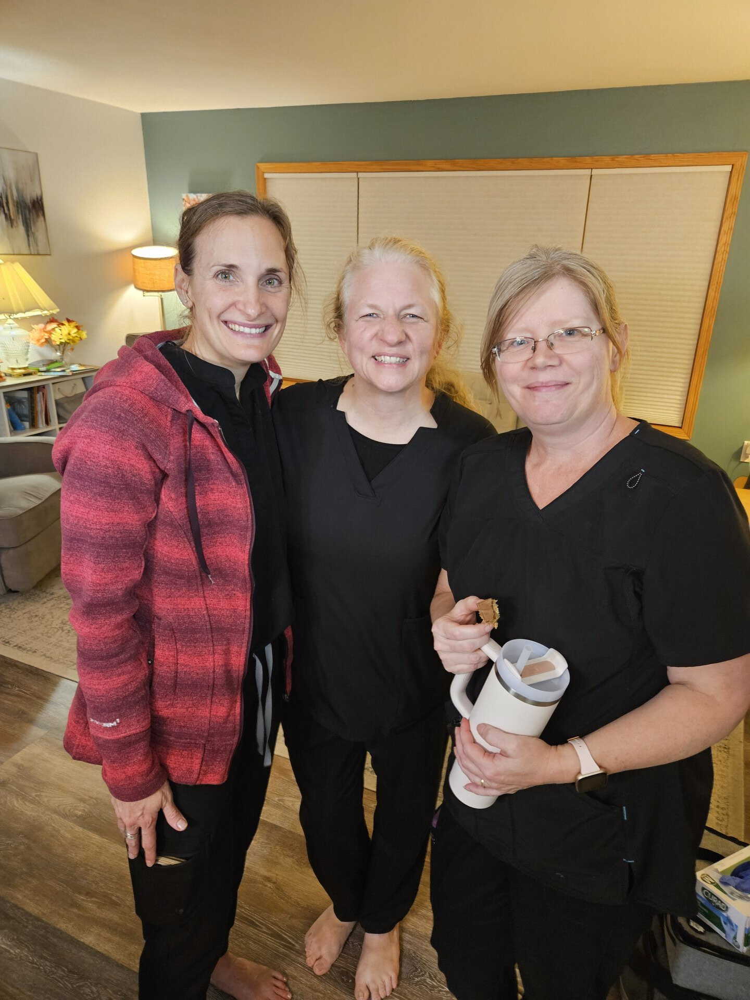
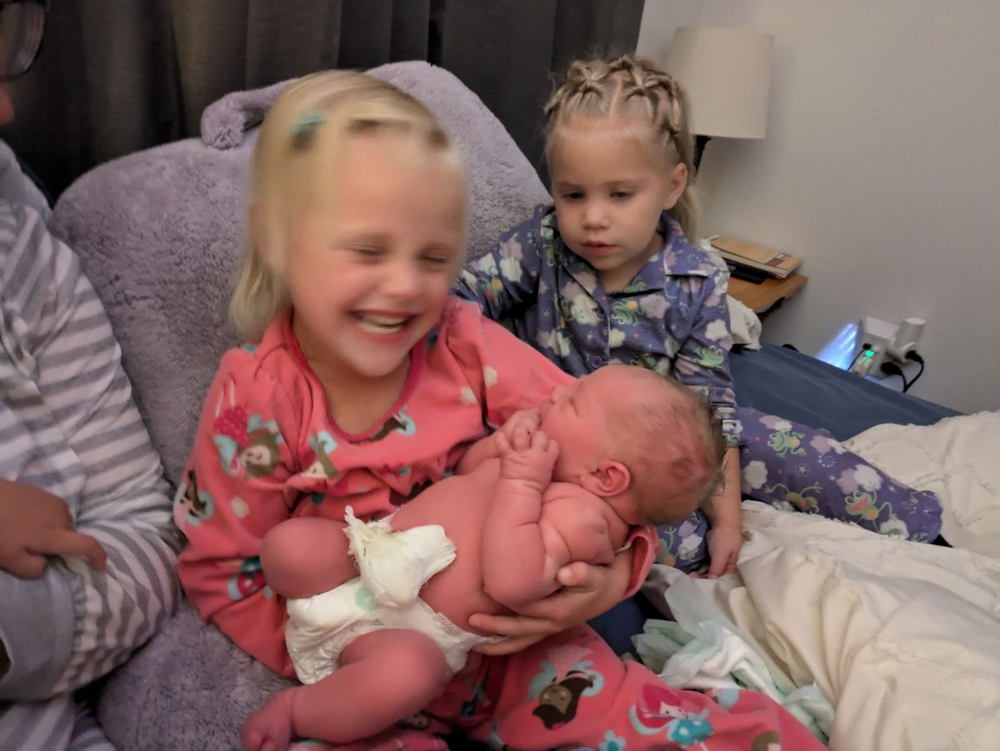

Praise God from whom all blessings flow! We had the joy of welcoming our fifth child, Brielle Kay McKeown on Sunday, October 13th. Our second home birth!

Entering the third trimester, I fully anticipated going past my due date. 3/4 of my other kids had ended up going past their due date, and with Blaise I drank midwives brew to kick labor into gear. My plan was to get to October 15th which was my due date, and drink the brew that evening. 

This fifth pregnancy was definitely the most physically challenging one I've experienced. I felt the most “pregnant” by far, and was dealing with sciatica pain for the first time. Overall, I’m very fortunate, and wasn’t miserable, but it was also my first time feeling more “done” with pregnancy. 

Saturday evening, everything was normal, James and I even had a date night. I went to bed, and then woke up around 2 am on Sunday morning noticing some contractions. They were serious enough that I didn’t want to lay in bed. I went downstairs by myself to chill with my exercise ball and started timing them. The contractions were feeling intense and lasted about 2-3 minutes, but were only about every 15 minutes. I thought it was maybe prodromal labor, and I anticipated that the contractions could stop. I didn't want to sound the alarm for nothing, yet I also knew things could move fast. 

At 3 am, I decided to call Stephanie my midwife to keep her updated just in case. She sounded surprisingly awake at 3am (I found out after Brielle was born they were just picking up their bags to leave following a birth they'd just attended when I called). She told me she’d check back in within half an hour, but to call if I wanted her sooner. Shortly after we hung up, I threw up, so I texted her that delightful information and told her I felt like labor was probably the real deal now. 

At this point, I went upstairs to wake up James and said we should start blowing up the birth pool. He got right to work, and I continued to work through some contractions upstairs in the living room. Stephanie texted back to check in at 3:50am and I told her that “James thinks you should come” and she responded by saying she was already in the driveway, haha. She knew!

She came in and after a time she checked me and said, “I don’t feel a cervix.” Me in labor land was confused and responded with, “what does that mean?” She said, “it means that you’re a 10!” I was surprised to be fully dilated since I only felt like I had been in real labor for about an hour now, but definitely pleased. 

I was sitting out in the living room on the couch and everything was covered in chucks pads while I was waiting for the birth tub in our room to be filled up/warm enough to get into. Very few (if any) houses have a big enough water heater to fill up the birth tub all the way with hot water, so while it is filling, you’re also boiling water on the stove to get the tub up to the right temperature. 
Stephanie mentioned to me that we were probably looking at a land birth as the pool wasn’t heated up quite yet, and we knew this baby was coming soon. However, I did not want to give birth in the living room! The water feels so nice, and contains the mess. I felt I would surely splatter the living room and didn’t want to do that. I could feel my body starting to push down automatically while on the couch and knew I wanted to head to the birth pool.

At around 4:40am, James called my mom and told her we were having a baby soon, and she hopped right in the car and arrived around 4:50am. This was the first birth of my kids she was able to attend, and her first birth attended in general!

I kept asking about the birth tub being ready, and finally I said “I’m walking back to our room.” 
I felt the water and said it felt warm enough, and they said it was for me, but it was the baby they were more concerned about.

While I was standing next to the pool, my body started shaking pretty intensely and my body began bearing down again. I felt a big pop and warm water down my legs. James was there supporting me and thought Stephanie had splashed him with the pool water haha! I said no, that was me splashing you. I heard Stephanie tell someone to get my mom who had just walked back to get more boiling water to add to the tub, and told her my water broke.

One thing I wanted to do this birth that I had never done before was to feel the baby coming out with my hand. I reached down and I could feel her head right there, and said “I’m getting in the tub!” While feeling quite awkward, I quickly but carefully climbed over the side and lowered myself into the water and felt my body push down again. The fetal ejection reflex is very real, and I have noticed it with my last 3 births that were unmedicated. I am just a passenger during the labor experience, and my body is pushing out the baby without my help at all. I quickly felt her head come out, then her shoulders, and boom she was born. It was seconds of me getting into the birth pool and she flew out! She felt noticeably easier to birth than Blaise who was 9lb 9oz.  

It was such a great and fast labor, I could hardly believe how fast everything was. I held her for a bit, feeling relieved and surprised it was over and James said, “what do we have?” Her umbilical cord was so long and draped right across her, so we moved that and saw she was indeed a girl. I had been guessing girl this whole pregnancy! I didn't stay long in the tub as the water wasn't quite as warm as they would like, so I moved to the bed to deliver the placenta. The best thing about home birth is getting into your own bed while holding your brand new perfect baby. She weighed 7lb 15oz; right in the middle of the five kids' weights.

Anothing detail was that while her head was coming out, I heard Blaise cry out, and he was awake for the day. We had decided that if I went into labor at night, we’d just let the kids sleep, but apparently they knew something exciting was happening in the house! My mom went to get him, and brought him into the room to meet his baby sister. Within the next hour, the other three were up as well and all got to see their baby sister, as well as where she was born and say hi to our wonderful birth team. 

